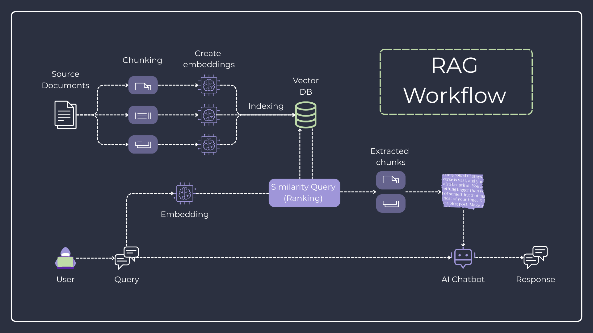

# 🏆 Ultimate Advisor - RAG-Powered Cricket Rules Assistant

A complete **Retrieval-Augmented Generation (RAG)** application that demonstrates modern AI capabilities for answering questions about cricket laws, playing conditions, and strategies. This project showcases how to build a production-ready RAG system using cutting-edge technologies.



## 🎯 **What This Project Demonstrates**

This repository serves as a **comprehensive tutorial project** for YouTube viewers learning about **RAG (Retrieval-Augmented Generation) implementation**.

## 🚀 **Key Features**

- **📚 Intelligent Document Processing**: Automatically indexes and processes the official cricket laws / rulebook PDF that you provide
- **🤖 AI-Powered Q&A**: Ask natural language questions about cricket rules and get accurate, context-aware answers
- **📊 Source Attribution**: Every answer includes relevant source documents with similarity scores and page references

## 🛠 **Technology Stack**

### **Backend (Python)**
- **FastAPI**: High-performance API framework with automatic OpenAPI documentation
- **SQLModel**: Modern Python SQL toolkit combining SQLAlchemy + Pydantic
- **LlamaIndex**: RAG framework for document processing and querying
- **PostgreSQL + pgvector**: Vector database for embeddings storage
- **Ollama**: Local LLM serving (supports Llama 3.2, Mistral, etc.)

### **Frontend (TypeScript/React)**
- **React 19**: Modern React with latest features
- **Vite**: Lightning-fast build tool
- **TailwindCSS**: Utility-first CSS framework
- **SWR**: Data fetching with caching and revalidation
- **Radix UI**: Accessible, unstyled UI components

### **Infrastructure**
- **Docker Compose**: Multi-container orchestration
- **pgvector**: PostgreSQL extension for vector operations
- **uv**: Fast Python package management

## 🏃‍♂️ **Quick Start**

### Prerequisites

- **Docker & Docker Compose** (required)
- **8GB+ RAM** (for running local LLMs)
- **NVIDIA GPU** (optional, for faster inference)
- **Git** (for cloning the repository)

### 1. Clone and Setup

```bash
# Clone the repository
git clone https://github.com/yourusername/UltimateAdvisor.git
cd UltimateAdvisor

# Copy environment template
cp .env.example .env
```

### 2. Configure Environment Variables

Edit `.env` with your preferred settings:

```bash
# Database Configuration
APP_PG_USER=postgres
APP_PG_PASSWORD=your_secure_password
APP_PG_DATABASE=ultimate_advisor
APP_PG_PORT=5432

# Ollama Models (you can change these)
APP_CHAT_MODEL=llama3.2:3b
APP_EMBEDDING_MODEL=nomic-embed-text:latest
```

### 3. Start All Services

```bash
# Start all services (this will download models automatically)
docker-compose up -d

# Monitor the logs to see when everything is ready
docker-compose logs -f
```

**Note**: First startup takes 5-10 minutes as it downloads the LLM models.

### 4. Load the Cricket Rulebook

```bash
# Index your Cricket Rulebook PDF (placed in the data/ folder)
uv run ./src/scripts/run_load_embeddings.py
```

### 5. Access the Application

- **UI**: http://localhost:8000
- **API Documentation**: http://localhost:8000/docs
- **API Redoc**: http://localhost:8000/redoc

## 📖 **Usage Examples**

Try asking these questions in the chat interface:

- "When is a batsman considered run out?"
- "How many players are on the field for each team in cricket?"
- "Explain the powerplay rules in One Day Internationals."
- "What are the fielding restrictions in T20 cricket?"
- "What are the dimensions of a cricket pitch and boundary?"

### Data Flow

1. **Document Processing**: PDF documents are chunked and embedded using Ollama
2. **Vector Storage**: Embeddings are stored in PostgreSQL with pgvector extension
3. **Query Processing**: User questions are embedded and matched against stored vectors
4. **Response Generation**: Retrieved context is sent to the chat model for answer generation
5. **History Tracking**: All conversations are persisted for future reference

## 🛠️ **Development Setup**

### Local Development (without Docker)

If you prefer to run services locally:

1. **Install Python dependencies:**
```bash
# Install uv package manager
curl -LsSf https://astral.sh/uv/install.sh | sh

# Install dependencies
uv sync
```

2. **Start PostgreSQL with pgvector:**
```bash
docker run -d \
  --name postgres-pgvector \
  -p 5432:5432 \
  -e POSTGRES_USER=postgres \
  -e POSTGRES_PASSWORD=password \
  -e POSTGRES_DB=ultimate_advisor \
  pgvector/pgvector:pg17
```

3. **Start Ollama:**
```bash
# Install Ollama (see https://ollama.ai)
ollama serve

# Pull required models
ollama pull gemma3:4b
ollama pull embeddinggemma:latest
```

4. **Initialize the database:**
```bash
uv run python src/scripts/run_init_db.py
```

5. **Load embeddings:**
```bash
uv run python src/scripts/run_load_embeddings.py
```

6. **Start the backend:**
```bash
uv run fastapi dev src/main.py --host 0.0.0.0 --port 8000
```

7. **Start the frontend:**
```bash
cd frontend
pnpm install
pnpm run dev
```
